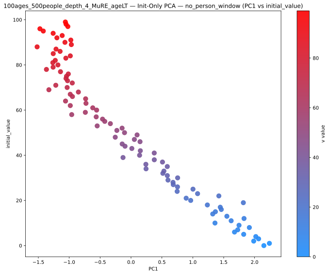
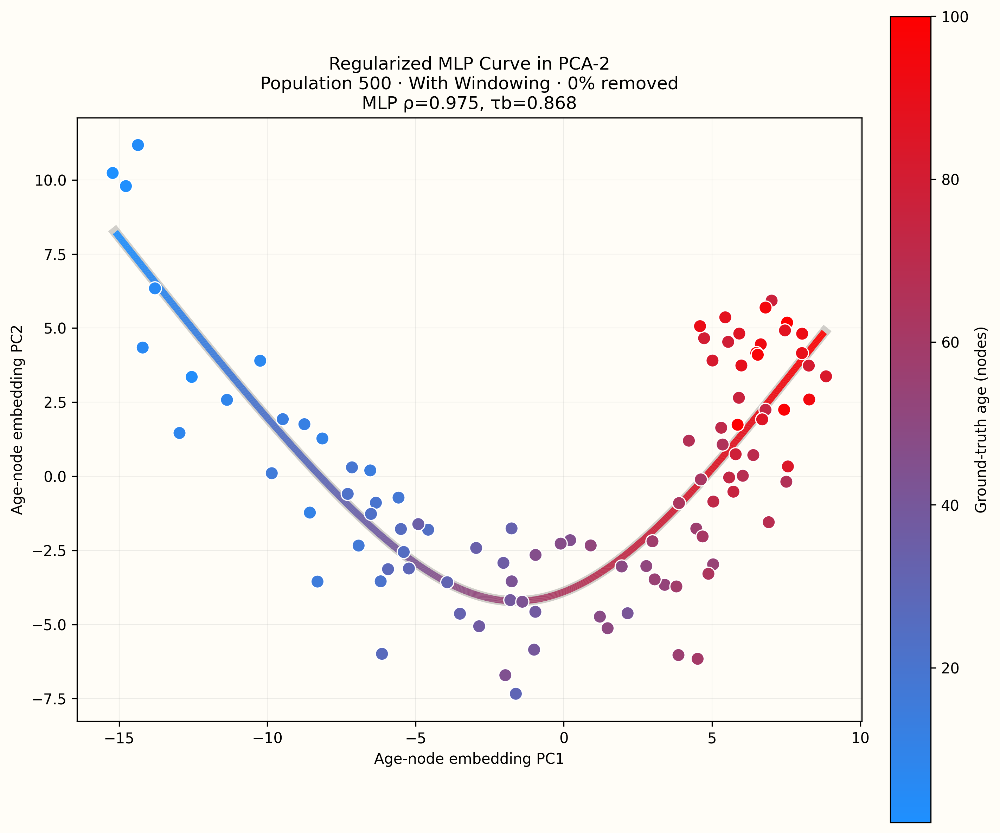
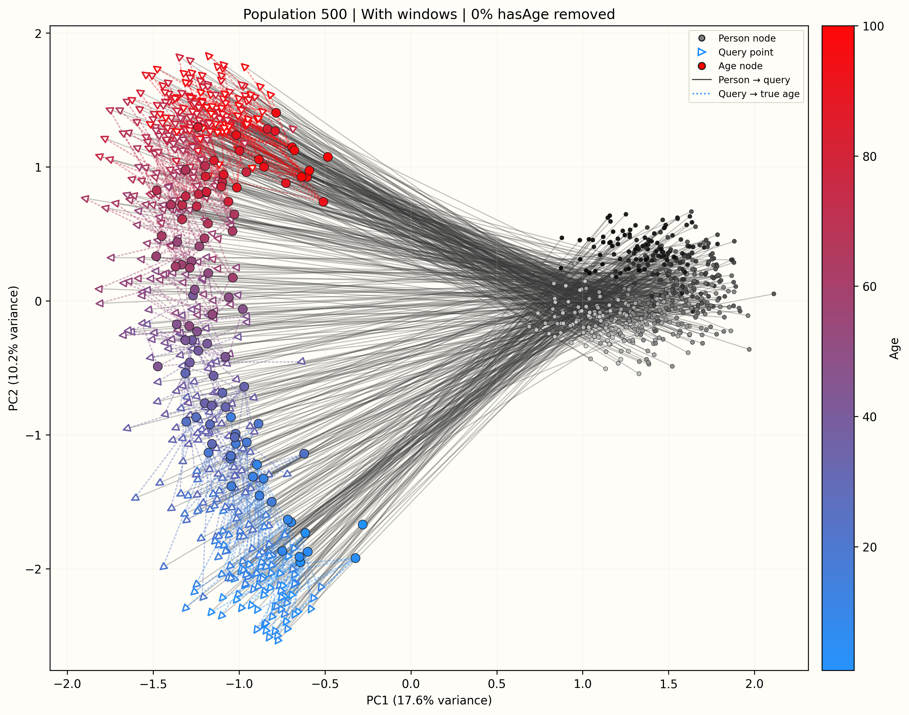

# Visualizations 

Most of these are plots we made early on in in this work and do not appear in the final paper; however, they are interesting and useful to understanding the motivations behind certain choices made in our experimental design. 

--- 

## PC1 vs Initialization Value

This figure shows the principle component of the embeddings of the "age" nodes plotted against the value the age node was instantiated used for materializing the KG but then subsequently discarded. The image shows a clear relationship between the topological arrangement of the embedding vectors with the values intially chosen, demonstrating that the embedding process has preserved a notion of montonicity.

---

# PC1

Similar to the above but only the principle component is shown. Essentially, just collapsing the above image, flat into its principle component.

---

## MLP Curve fit to Principle Components 1 and 2

This figure shows principle components 1 and 2 of the age vectors with an MLP curve learned in the two-dimensional PCA. This step is mainly to visually demonstrate that a notion of monotonicity is preserved in the embedding space and is recoverable using principle component analysis and a multi-layer perceptron.

The metrics (Spearman's rho and Kendall's tau-b) are comparisons of ordering preserved in PC1 and MLP+2D-PCA both between the ordering in the ground truth. 

--- 

## Relation Topology in 2D-PCA

This figure shows the person and age nodes along with the relational vectors (R and r) "applied" (R $\odot$ h + r) to the person node with a dotted line to that person's respective age. 

This visualizes the MuRE scoring function in 2D-PCA, demonstrating how relations are preserved in the embedding space using our synthetic knowledge graph structure.
