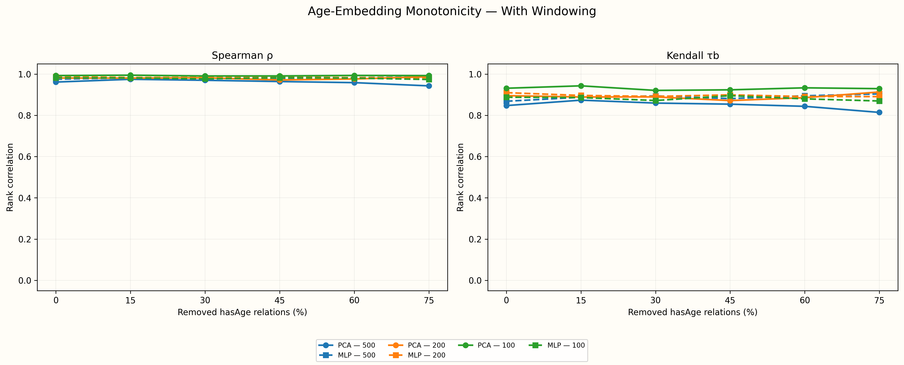
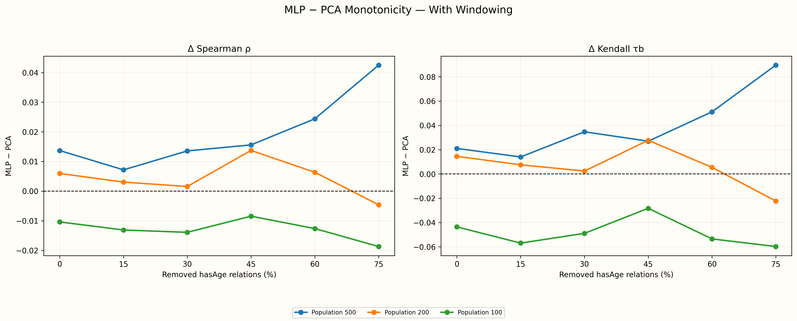
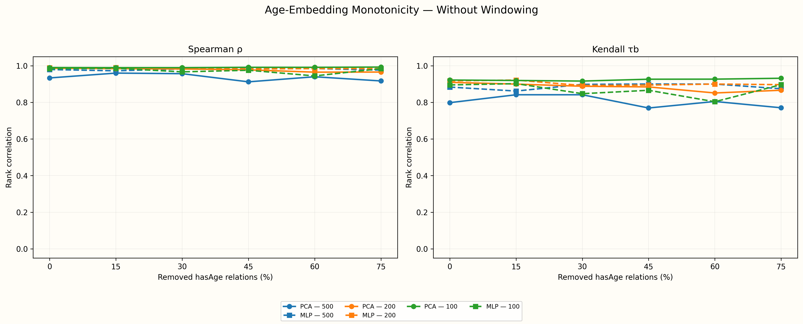
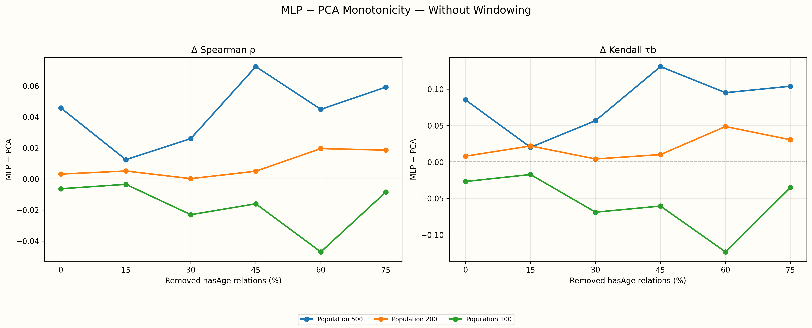

# Age-Node Embedding Monotonicity

Age-node embeddings are standardized once and projected into one shared PCA-2 space per run. PCA statistics use PC1. One regularized MLP maps normalized PC1 to the PCA-2 coordinates; each node's nearest position on that same fitted curve supplies the MLP coordinate used for Spearman and Kendall statistics. The exact same curve is drawn in the per-run visualizations.

Ground-truth age is used only after fitting to orient each one-dimensional coordinate toward increasing age.

## With Windowing

| Population | Removal % | PCA Spearman ρ | PCA Kendall τb | MLP Spearman ρ | MLP Kendall τb |
| --- | --- | --- | --- | --- | --- |
| 500 | 0% | 0.9613 | 0.8473 | 0.9750 | 0.8683 |
| 500 | 15% | 0.9748 | 0.8735 | 0.9819 | 0.8875 |
| 500 | 30% | 0.9699 | 0.8594 | 0.9835 | 0.8941 |
| 500 | 45% | 0.9639 | 0.8541 | 0.9795 | 0.8811 |
| 500 | 60% | 0.9585 | 0.8436 | 0.9829 | 0.8948 |
| 500 | 75% | 0.9428 | 0.8141 | 0.9853 | 0.9038 |
| 200 | 0% | 0.9809 | 0.8954 | 0.9869 | 0.9099 |
| 200 | 15% | 0.9805 | 0.8889 | 0.9835 | 0.8964 |
| 200 | 30% | 0.9818 | 0.8893 | 0.9834 | 0.8917 |
| 200 | 45% | 0.9716 | 0.8715 | 0.9853 | 0.8992 |
| 200 | 60% | 0.9763 | 0.8857 | 0.9826 | 0.8911 |
| 200 | 75% | 0.9872 | 0.9131 | 0.9826 | 0.8908 |
| 100 | 0% | 0.9926 | 0.9313 | 0.9822 | 0.8877 |
| 100 | 15% | 0.9945 | 0.9430 | 0.9814 | 0.8861 |
| 100 | 30% | 0.9908 | 0.9208 | 0.9769 | 0.8719 |
| 100 | 45% | 0.9909 | 0.9236 | 0.9825 | 0.8953 |
| 100 | 60% | 0.9932 | 0.9333 | 0.9806 | 0.8798 |
| 100 | 75% | 0.9925 | 0.9293 | 0.9738 | 0.8695 |

## Without Windowing

| Population | Removal % | PCA Spearman ρ | PCA Kendall τb | MLP Spearman ρ | MLP Kendall τb |
| --- | --- | --- | --- | --- | --- |
| 500 | 0% | 0.9335 | 0.7984 | 0.9793 | 0.8836 |
| 500 | 15% | 0.9600 | 0.8416 | 0.9724 | 0.8618 |
| 500 | 30% | 0.9567 | 0.8416 | 0.9827 | 0.8983 |
| 500 | 45% | 0.9122 | 0.7693 | 0.9846 | 0.9002 |
| 500 | 60% | 0.9399 | 0.8048 | 0.9848 | 0.8999 |
| 500 | 75% | 0.9170 | 0.7705 | 0.9762 | 0.8745 |
| 200 | 0% | 0.9862 | 0.9095 | 0.9894 | 0.9175 |
| 200 | 15% | 0.9844 | 0.8998 | 0.9895 | 0.9218 |
| 200 | 30% | 0.9826 | 0.8881 | 0.9828 | 0.8922 |
| 200 | 45% | 0.9777 | 0.8844 | 0.9827 | 0.8946 |
| 200 | 60% | 0.9650 | 0.8513 | 0.9846 | 0.9000 |
| 200 | 75% | 0.9656 | 0.8663 | 0.9842 | 0.8968 |
| 100 | 0% | 0.9903 | 0.9220 | 0.9840 | 0.8953 |
| 100 | 15% | 0.9897 | 0.9196 | 0.9863 | 0.9024 |
| 100 | 30% | 0.9897 | 0.9164 | 0.9667 | 0.8475 |
| 100 | 45% | 0.9915 | 0.9265 | 0.9755 | 0.8660 |
| 100 | 60% | 0.9914 | 0.9269 | 0.9445 | 0.8035 |
| 100 | 75% | 0.9928 | 0.9317 | 0.9844 | 0.8967 |

