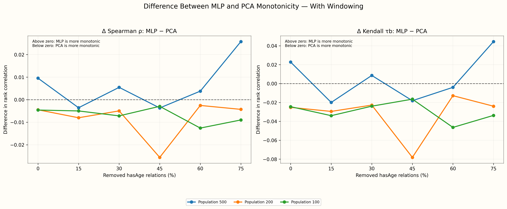
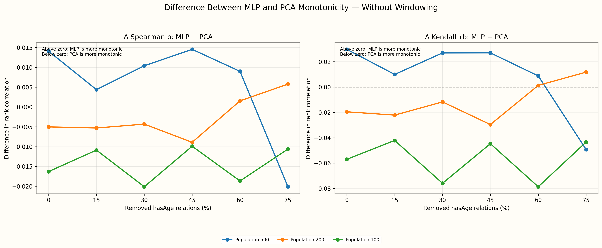

# Age-Node Embedding Monotonicity

Spearman’s ρ and Kendall’s τb compare ground-truth age ordering with one-dimensional coordinates learned from age-node embeddings.

Neither PCA nor the MLP principal curve uses numeric age while fitting its one-dimensional coordinate. True ages are used only afterward to calculate rank correlations.

PCA measures ordering along the dominant unsupervised linear direction. The MLP principal curve measures ordering along an unsupervised nonlinear one-dimensional curve initialized from PCA and refined through nearest-curve projection.

One-dimensional coordinates have arbitrary direction. Their signs are therefore oriented toward increasing age before reporting the correlations.

In the gap plots, the difference is `MLP correlation − PCA correlation`. Positive values indicate stronger MLP monotonicity; negative values indicate stronger PCA monotonicity.

## With Windowing

| Population Size | Removal % | PCA Spearman ρ | PCA Kendall τb | MLP Spearman ρ | MLP Kendall τb |
| --- | --- | --- | --- | --- | --- |
| 500 | 0% | 0.9774 | 0.8788 | 0.9869 | 0.9016 |
| 500 | 15% | 0.9847 | 0.9002 | 0.9811 | 0.8802 |
| 500 | 30% | 0.9757 | 0.8784 | 0.9811 | 0.8870 |
| 500 | 45% | 0.9769 | 0.8776 | 0.9733 | 0.8595 |
| 500 | 60% | 0.9768 | 0.8844 | 0.9805 | 0.8805 |
| 500 | 75% | 0.9570 | 0.8436 | 0.9827 | 0.8881 |
| 200 | 0% | 0.9881 | 0.9156 | 0.9836 | 0.8904 |
| 200 | 15% | 0.9884 | 0.9156 | 0.9804 | 0.8861 |
| 200 | 30% | 0.9904 | 0.9180 | 0.9854 | 0.8952 |
| 200 | 45% | 0.9861 | 0.9051 | 0.9605 | 0.8269 |
| 200 | 60% | 0.9852 | 0.9046 | 0.9827 | 0.8919 |
| 200 | 75% | 0.9909 | 0.9273 | 0.9866 | 0.9033 |
| 100 | 0% | 0.9900 | 0.9224 | 0.9854 | 0.8980 |
| 100 | 15% | 0.9936 | 0.9442 | 0.9886 | 0.9103 |
| 100 | 30% | 0.9903 | 0.9196 | 0.9832 | 0.8957 |
| 100 | 45% | 0.9909 | 0.9236 | 0.9879 | 0.9071 |
| 100 | 60% | 0.9922 | 0.9277 | 0.9796 | 0.8813 |
| 100 | 75% | 0.9922 | 0.9301 | 0.9833 | 0.8964 |

### Monotonicity Across Removal Levels

### Difference Between PCA and MLP

## Without Windowing

| Population Size | Removal % | PCA Spearman ρ | PCA Kendall τb | MLP Spearman ρ | MLP Kendall τb |
| --- | --- | --- | --- | --- | --- |
| 500 | 0% | 0.9622 | 0.8469 | 0.9763 | 0.8766 |
| 500 | 15% | 0.9766 | 0.8776 | 0.9810 | 0.8875 |
| 500 | 30% | 0.9745 | 0.8735 | 0.9849 | 0.9005 |
| 500 | 45% | 0.9618 | 0.8517 | 0.9764 | 0.8787 |
| 500 | 60% | 0.9618 | 0.8497 | 0.9708 | 0.8585 |
| 500 | 75% | 0.9606 | 0.8493 | 0.9405 | 0.8000 |
| 200 | 0% | 0.9895 | 0.9200 | 0.9845 | 0.9005 |
| 200 | 15% | 0.9911 | 0.9224 | 0.9858 | 0.9003 |
| 200 | 30% | 0.9883 | 0.9051 | 0.9839 | 0.8933 |
| 200 | 45% | 0.9830 | 0.8966 | 0.9741 | 0.8670 |
| 200 | 60% | 0.9842 | 0.8990 | 0.9858 | 0.9003 |
| 200 | 75% | 0.9822 | 0.9038 | 0.9879 | 0.9156 |
| 100 | 0% | 0.9921 | 0.9281 | 0.9758 | 0.8711 |
| 100 | 15% | 0.9922 | 0.9305 | 0.9813 | 0.8884 |
| 100 | 30% | 0.9935 | 0.9362 | 0.9734 | 0.8602 |
| 100 | 45% | 0.9928 | 0.9337 | 0.9829 | 0.8890 |
| 100 | 60% | 0.9940 | 0.9398 | 0.9754 | 0.8611 |
| 100 | 75% | 0.9938 | 0.9366 | 0.9831 | 0.8931 |

### Monotonicity Across Removal Levels

### Difference Between PCA and MLP

