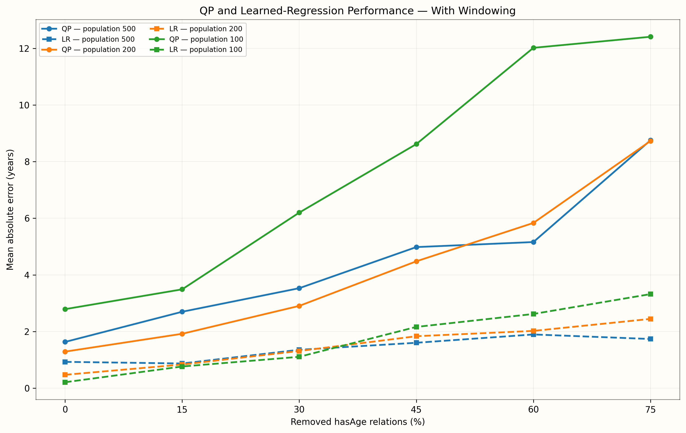
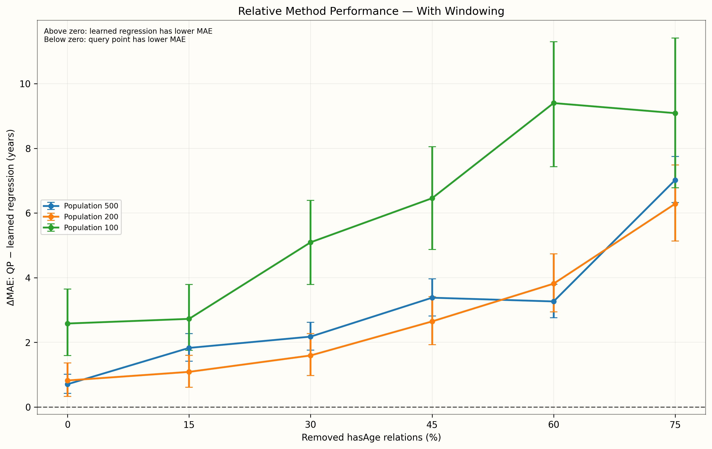
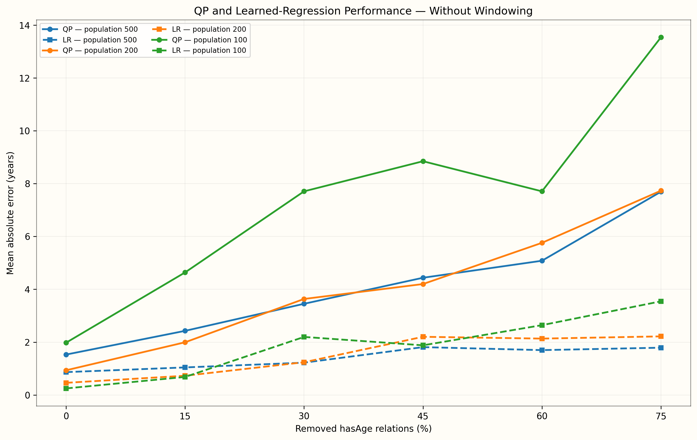
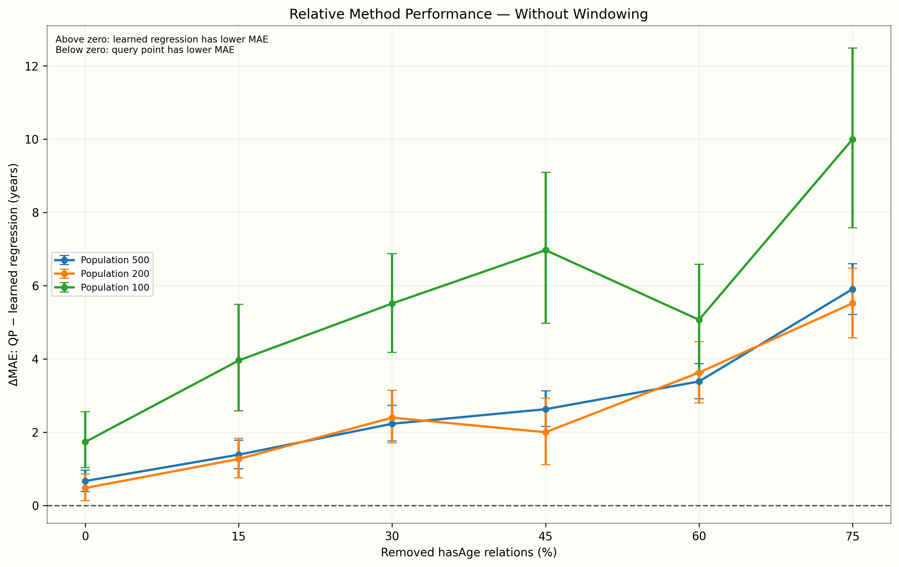

# Query-Point vs. Learned-Regression Statistical Comparison

This report compares query-point and learned-regression absolute errors for the same people under each population size, removal percentage, and window condition.

`ΔMAE QP−LR` is query-point MAE minus learned-regression MAE. Positive values favor learned regression; negative values favor the query-point method.

The confidence intervals use 5,000 bootstrap samples. The paired t-test and Wilcoxon signed-rank test are two-sided. P-values are unadjusted for multiple comparisons.

## With Windowing

| Population Size | Removal % | QP MAE/SD (years) | LR MAE/SD (years) | ΔMAE QP−LR (years) | 95% Bootstrap CI | Paired t p | Wilcoxon p | Cohen's dz | Lower MAE |
| --- | --- | --- | --- | --- | --- | --- | --- | --- | --- |
| 500 | 0% | 1.632, 3.333 | 0.929, 0.726 | 0.703 | [0.418, 1.011] | <0.0001 | 0.0029 | 0.207 | Learned Regression |
| 500 | 15% | 2.698, 4.910 | 0.871, 0.801 | 1.827 | [1.416, 2.268] | <0.0001 | 0.0096 | 0.378 | Learned Regression |
| 500 | 30% | 3.530, 5.101 | 1.355, 1.768 | 2.175 | [1.758, 2.617] | <0.0001 | <0.0001 | 0.443 | Learned Regression |
| 500 | 45% | 4.982, 6.600 | 1.603, 2.132 | 3.379 | [2.811, 3.960] | <0.0001 | <0.0001 | 0.521 | Learned Regression |
| 500 | 60% | 5.160, 5.822 | 1.896, 2.268 | 3.264 | [2.763, 3.796] | <0.0001 | <0.0001 | 0.545 | Learned Regression |
| 500 | 75% | 8.754, 8.203 | 1.736, 1.810 | 7.018 | [6.322, 7.751] | <0.0001 | <0.0001 | 0.871 | Learned Regression |
| 200 | 0% | 1.290, 3.740 | 0.471, 0.518 | 0.819 | [0.328, 1.362] | 0.0022 | <0.0001 | 0.219 | Learned Regression |
| 200 | 15% | 1.920, 4.139 | 0.835, 1.619 | 1.085 | [0.608, 1.597] | <0.0001 | 0.0124 | 0.313 | Learned Regression |
| 200 | 30% | 2.905, 5.074 | 1.313, 2.257 | 1.592 | [0.973, 2.271] | <0.0001 | 0.9854 | 0.337 | Learned Regression |
| 200 | 45% | 4.480, 5.545 | 1.834, 2.741 | 2.646 | [1.924, 3.409] | <0.0001 | <0.0001 | 0.496 | Learned Regression |
| 200 | 60% | 5.835, 6.914 | 2.022, 2.531 | 3.813 | [2.939, 4.735] | <0.0001 | <0.0001 | 0.580 | Learned Regression |
| 200 | 75% | 8.730, 8.397 | 2.446, 2.492 | 6.284 | [5.133, 7.484] | <0.0001 | <0.0001 | 0.739 | Learned Regression |
| 100 | 0% | 2.790, 5.470 | 0.209, 0.374 | 2.581 | [1.592, 3.646] | <0.0001 | 0.7129 | 0.478 | Learned Regression |
| 100 | 15% | 3.490, 5.663 | 0.765, 1.844 | 2.725 | [1.751, 3.787] | <0.0001 | 0.0077 | 0.519 | Learned Regression |
| 100 | 30% | 6.200, 7.333 | 1.107, 2.158 | 5.093 | [3.791, 6.393] | <0.0001 | <0.0001 | 0.751 | Learned Regression |
| 100 | 45% | 8.620, 8.430 | 2.163, 3.066 | 6.457 | [4.873, 8.051] | <0.0001 | <0.0001 | 0.800 | Learned Regression |
| 100 | 60% | 12.020, 10.111 | 2.620, 3.257 | 9.400 | [7.432, 11.296] | <0.0001 | <0.0001 | 0.951 | Learned Regression |
| 100 | 75% | 12.410, 12.256 | 3.321, 3.473 | 9.089 | [6.781, 11.410] | <0.0001 | <0.0001 | 0.774 | Learned Regression |

### MAE Across Removal Levels

### Difference Between Methods

## Without Windowing

| Population Size | Removal % | QP MAE/SD (years) | LR MAE/SD (years) | ΔMAE QP−LR (years) | 95% Bootstrap CI | Paired t p | Wilcoxon p | Cohen's dz | Lower MAE |
| --- | --- | --- | --- | --- | --- | --- | --- | --- | --- |
| 500 | 0% | 1.530, 3.333 | 0.865, 0.682 | 0.665 | [0.378, 0.966] | <0.0001 | <0.0001 | 0.196 | Learned Regression |
| 500 | 15% | 2.428, 4.384 | 1.043, 1.039 | 1.385 | [1.001, 1.778] | <0.0001 | 0.5514 | 0.318 | Learned Regression |
| 500 | 30% | 3.452, 5.710 | 1.223, 1.535 | 2.229 | [1.758, 2.730] | <0.0001 | <0.0001 | 0.398 | Learned Regression |
| 500 | 45% | 4.438, 5.653 | 1.811, 2.436 | 2.627 | [2.155, 3.126] | <0.0001 | <0.0001 | 0.469 | Learned Regression |
| 500 | 60% | 5.082, 5.498 | 1.698, 2.074 | 3.384 | [2.915, 3.871] | <0.0001 | <0.0001 | 0.623 | Learned Regression |
| 500 | 75% | 7.694, 7.764 | 1.790, 1.934 | 5.904 | [5.210, 6.598] | <0.0001 | <0.0001 | 0.744 | Learned Regression |
| 200 | 0% | 0.935, 2.572 | 0.460, 0.416 | 0.475 | [0.133, 0.855] | 0.0102 | <0.0001 | 0.183 | Learned Regression |
| 200 | 15% | 1.995, 4.053 | 0.728, 1.463 | 1.267 | [0.756, 1.831] | <0.0001 | 0.0256 | 0.331 | Learned Regression |
| 200 | 30% | 3.635, 5.557 | 1.239, 2.319 | 2.396 | [1.705, 3.144] | <0.0001 | 0.0003 | 0.466 | Learned Regression |
| 200 | 45% | 4.200, 6.724 | 2.203, 3.168 | 1.997 | [1.115, 2.929] | <0.0001 | 0.5788 | 0.302 | Learned Regression |
| 200 | 60% | 5.760, 6.585 | 2.134, 2.758 | 3.626 | [2.799, 4.470] | <0.0001 | <0.0001 | 0.584 | Learned Regression |
| 200 | 75% | 7.735, 6.968 | 2.218, 2.388 | 5.517 | [4.571, 6.474] | <0.0001 | <0.0001 | 0.806 | Learned Regression |
| 100 | 0% | 1.980, 3.913 | 0.248, 0.215 | 1.732 | [1.028, 2.561] | <0.0001 | 0.9015 | 0.443 | Learned Regression |
| 100 | 15% | 4.640, 7.542 | 0.683, 1.647 | 3.957 | [2.581, 5.490] | <0.0001 | 0.0018 | 0.538 | Learned Regression |
| 100 | 30% | 7.710, 6.696 | 2.197, 3.927 | 5.513 | [4.181, 6.876] | <0.0001 | <0.0001 | 0.788 | Learned Regression |
| 100 | 45% | 8.850, 11.139 | 1.880, 2.987 | 6.970 | [4.969, 9.097] | <0.0001 | <0.0001 | 0.641 | Learned Regression |
| 100 | 60% | 7.710, 7.320 | 2.643, 3.371 | 5.067 | [3.627, 6.586] | <0.0001 | <0.0001 | 0.677 | Learned Regression |
| 100 | 75% | 13.540, 12.463 | 3.545, 3.776 | 9.995 | [7.576, 12.484] | <0.0001 | <0.0001 | 0.810 | Learned Regression |

### MAE Across Removal Levels

### Difference Between Methods

## Metric Notes

- **QP MAE/SD:** mean and sample standard deviation of query-point absolute errors.
- **LR MAE/SD:** mean and sample standard deviation of learned-regression absolute errors.
- **95% Bootstrap CI:** confidence interval for the mean paired difference, QP error minus LR error.
- **Paired t p:** tests whether the mean paired difference is zero.
- **Wilcoxon p:** signed-rank robustness test for the paired differences.
- **Cohen's dz:** mean paired difference divided by the sample standard deviation of the paired differences.
